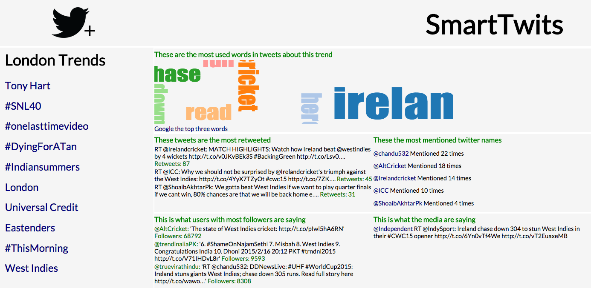

# Smart Twits

 

This project was a three day exercise ("Makerthon") as part of the Makers Academy Web Development Bootcamp.

###Makeathon Team:
- Andy Newman (@andyg72)
- Bibiana Cristofol (@BibianaC)
- Emily Sas (@emilysas)
- Marcin Walendzik (@marcinwal)
- Richard Ighodaro (@iggyster3)

##Top Level User Story
- As a time pressed, new hungry individual
- I want to understand the meaning behind Twitter's top trends

  

##Solution
SmartTwits aims to provide users with information about currently trending tweets with a view to shedding a little light on the context of the trend. It displays the top ten trending tweets on the left hand side, and upon users clicking these, provides details of:

* the most frequently occuring words within the trending tweets
* the trending tweets that have the most retweets
* the most frequently occuring mentions within the trending tweets
* the trending tweets from users with the most followers
* trending tweets that originated from media organisations

###Components
The solution has two key elements;
- a back end, that can operate on a set schedule (defaulted to 10 minutes), that retrieves the top trends and gathers associated information and writes it to flat files.
- a front end, that manipulates and presents the information to the user.

##How to run the app

###Creating data
Before running any queries against the Twitter API, you will need to have set up credentials with Twitter.
These then need to be stored in a credentials.md file in the root of the repository, with the following structure;

Consumer_Key(API_Key):xxxxxxxxx

Consumer_Secret(API_Secret):xxxxxxxx

Access_Token:xxxxxxxxx

Access_Token_Secret:xxxxxxxxxx

####On a scheduled
(section to be completed)

####As a one off exercise
$ enter IRB
- require './lib/api_twit'
- update = APITwitter.new
- update.refresh_all_twitter_data

###Running the front end
$ rackup
- open http://localhost:9292/

Then click on any of the top trends on the left hand side and the information will update.
